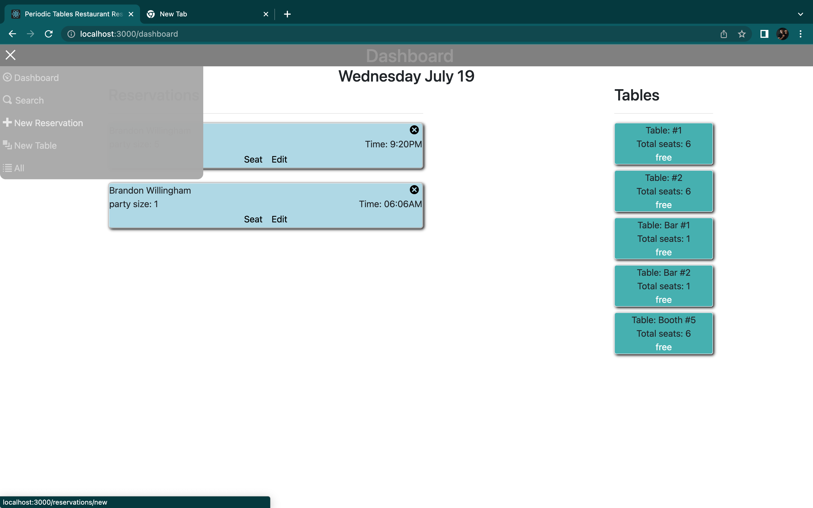
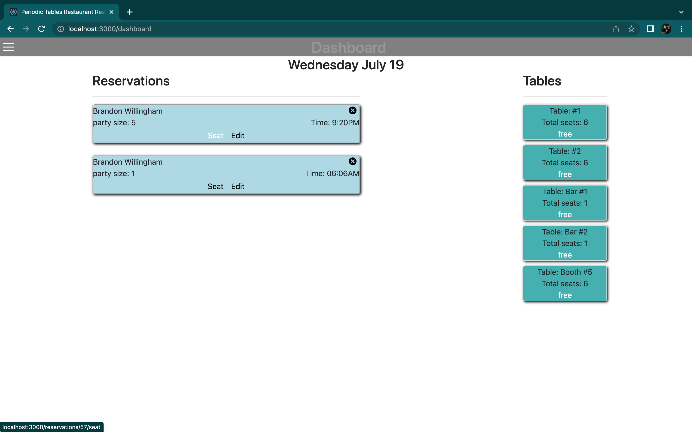
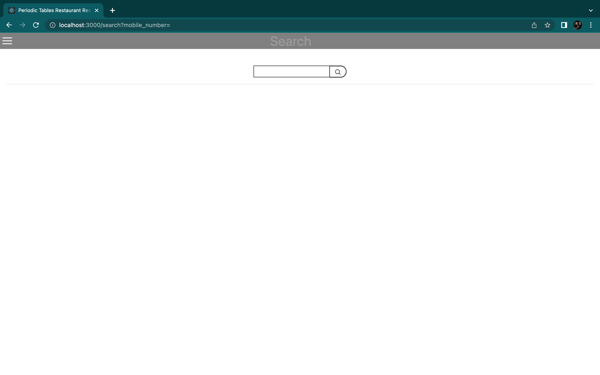
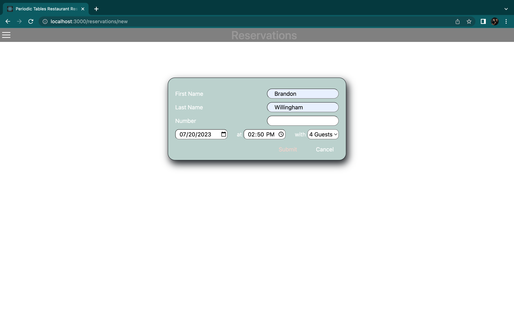
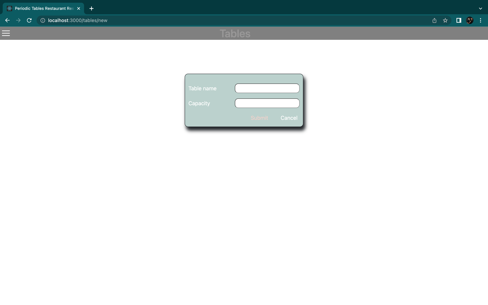
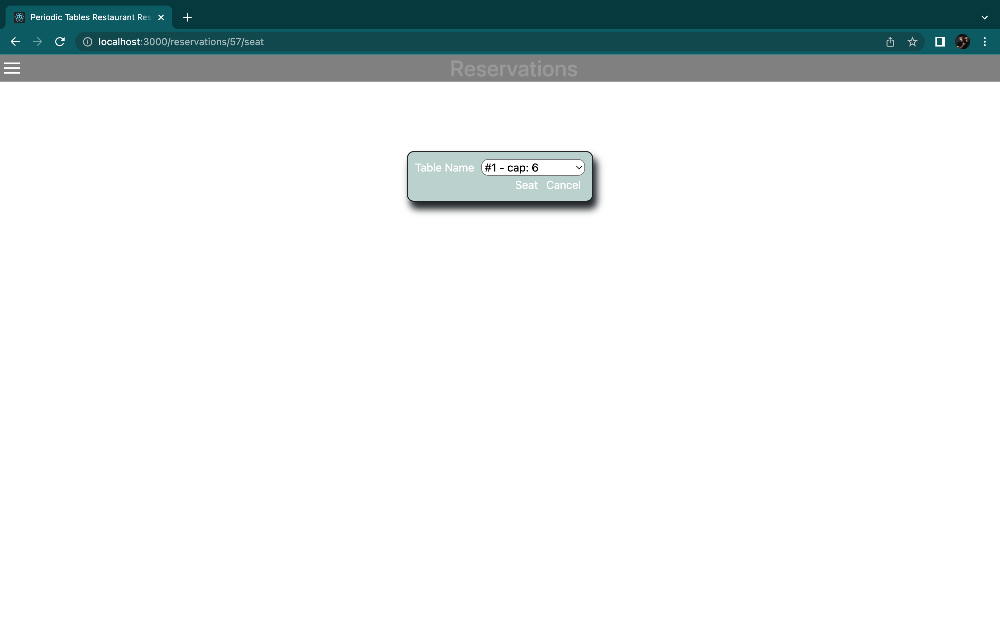
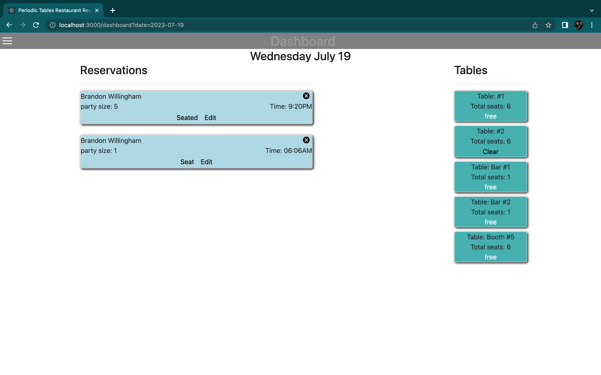

# Restaurant Reservation System

This is a capstone project from thinkful.
The objective is to create a web app that stores and manages reservations for a fine dining restaurant. 

I am practicing my abilities to CRUD data from a database in a practical way for buisnesses 

Tech utilitzed for this project:
JS,
HTML,
CSS,
React,
bootsrap,
node.js,
expresss,
knex,
postgreSQL,
dbever
 

Practiced implimenting animations with clickables and an animated drop down menu. 
You can view, delete, edit, or seat reservations and asign reservations to a table or clear the table and delete the reservation

Query reservations by mobile number

Create new Reservations and new tables for your resturant 

<!-- 

<container> 
    

    
    

    <spacer ></spacer>
    

    
    

</container>

<container>
    

        
    

    <spacer> </spacer>
    

        
    

</container>

Query reservations by mobile number
<container>
    

    
    

    <spacer> </spacer>
    

    
    

</container>

Create new Reservations and new tables for your resturant 
<container>
    

    
    

    <spacer> </spacer>
    

    
    

</container> -->
